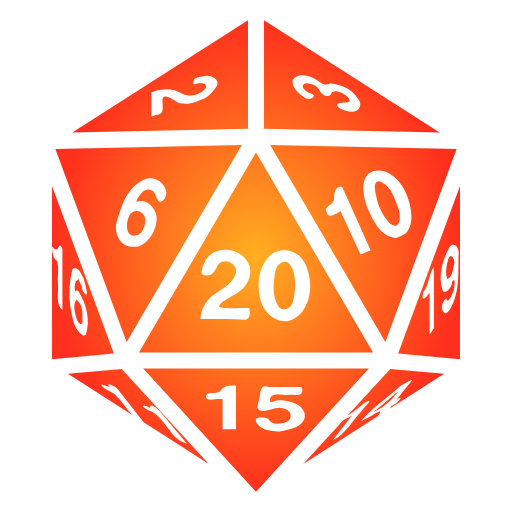

# Foundry Virtual Tabletop

[https://foundryvtt.com/](https://foundryvtt.com/)

<iframe width="560" height="315" src="https://www.youtube.com/embed/9RlXQCi9TQI" frameborder="0" allow="accelerometer; autoplay; encrypted-media; gyroscope; picture-in-picture" allowfullscreen></iframe>

Foundry Virtual Tabletop은 셀프 호스팅 방식의 웹 기반 가상 테이블탑입니다.  
2020년 5월 22일 정식으로 발매됐습니다.
라이선스 가격은 미화 50 달러입니다.

## 장점

* 모던 웹 기술로 만들어져 Roll20에 비해 성능이 좋고 다양한 기능을 지원합니다.
* 한번 구매하면 용량이나 기능 제한 없이 자유롭게 사용할 수 있습니다.
* API가 공개돼 있어 직접 모듈을 개발해 기능을 추가할 수 있고 다른 사람이 개발한 모듈도 쉽게 설치할 수 있습니다.

## 단점

* 서비스 제공자가 서버를 운영하는 타 플랫폼과 달리 직접 호스팅해야 합니다.
* 게임 룰 시스템을 공식으로 지원하는 것이 아니라 사용자들이 직접 개발합니다. 때문에 Roll20, Fantasy Grounds 등의 플랫폼처럼 메이저 룰 데이터를 직접 구매해서 사용할 수 없습니다.
* 마이너 룰 면에서도 수많은 사용자들이 각종 룰의 캐릭터 시트를 구현해 둔 Roll20에 비해 아직 지원하는 룰 시스템이 적은 편입니다. 2020년 7월 7일 기준으로 아래 목록의 룰 시스템이 개발되어 있습니다.

  * 제13시대 (아크메이지 엔진)
  * D&D 5판 (Foundry Virtual Tabletop 개발자가 직접 개발 중인 시스템)
  * 던전 월드
  * 페이트 (코어, 기동형, Condensed)
  * 누메네라
  * 패스파인더 1판
  * 패스파인더 2판 (가장 활발하게 개발 중인 시스템)
  * 섀도우런 5판
  * 스타파인더
  * 새비지 월드 어드벤쳐 에디션
  * 워해머 판타지 롤플레이 4판
  * 카미가카리
  * 에이지 오브 지그마
  * 콜 오브 크툴루 7판
  * 기타 몇몇 룰

이 외에도 공식으로 지원하는 언어가 영어 뿐이라는 점이 있긴 하지만 대부분의 가상 게임테이블이 영어만 지원하므로 따로 단점에 기재하지는 않았습니다.
모듈 형식으로 로컬라이징을 할 수 있으며 현재 기본 소프트웨어, D&D 5판, 던전 월드, 제13시대, 카미가카리 등의 시스템이 한국어화 되어 있습니다.

셀프 호스팅 방식이라는 것이 가장 큰 장점이자 단점으로 사용자가 원하는 방식으로 자유롭게 커스터마이즈 할 수 있고 Roll20의 느린 서버로부터 자유로울 수 있지만 컴퓨터와 친숙하지 않은 사용자는 호스팅이 생소할 수 있습니다.
이 사이트에서는 컴퓨터에 숙련 보너스를 받지 않는 게임마스터도 간단하게 호스팅 환경을 구축할 수 있도록 돕는 것을 목표로 몇 가지 가이드를 제공합니다.
