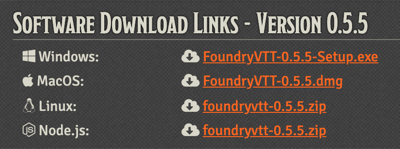
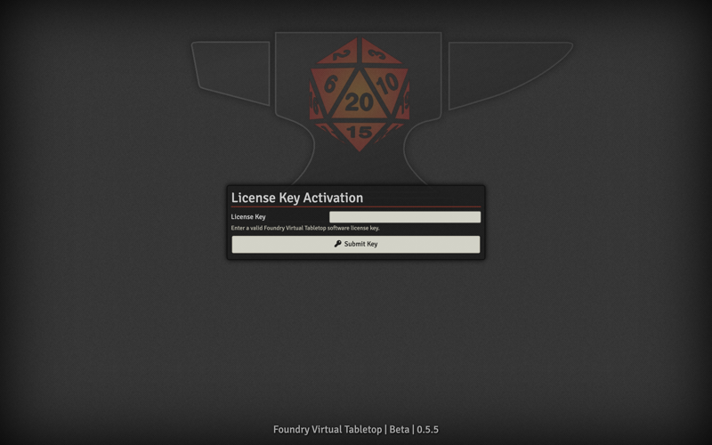
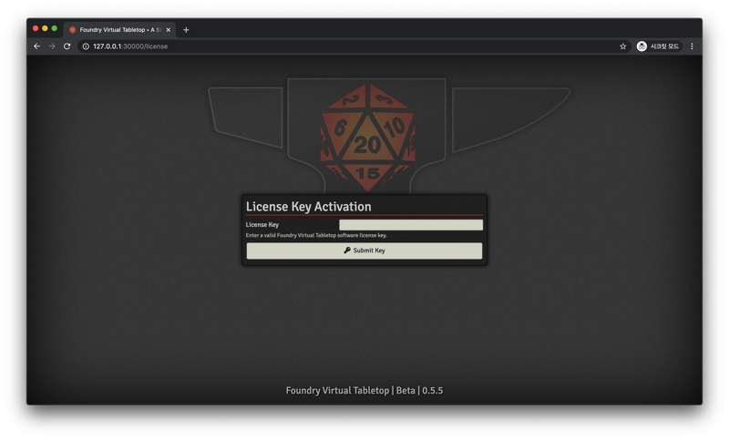
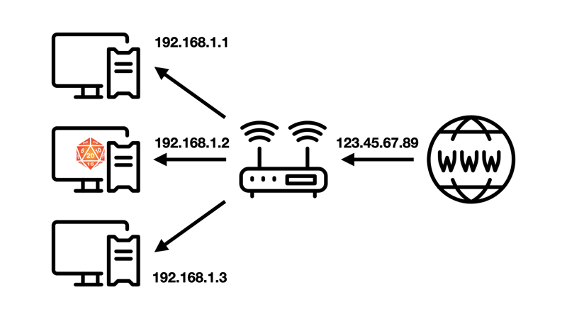

# 개인 PC로 호스팅하기

Foundry Virtual Tabletop 공식 사이트에서 라이선스를 구매한 후 프로필 페이지의 Purchased License 항목에서 현재 PC의 운영체제에 맞는 프로그램을 다운받습니다.

다운받은 프로그램을 설치 후 실행하면 위와 같이 프로그램이 전체화면으로 열리며 이 프로그램이 열려 있는 동안 PC는 Foundry Virtual Tabletop을 호스팅하는 서버 역할을 하게 됩니다.

제대로 작동하는지 확인해 보기 위해 인터넷 브라우저로 접속해 봅시다.
인터넷 브라우저의 주소창에 `127.0.0.1:30000`를 입력 후 이동하면 아까 열린 프로그램처럼 Foundry Virtual Tabletop 페이지가 나타납니다.

`127.0.0.1`는 루프백 IP로 현재 PC에서 자기 자신을 가리키는 IP입니다.
뒤에 붙은 `:30000`은 Foundry Virtual Tabletop에서 사용하는 기본 포트 번호입니다.
다른 플레이어가 이 PC에서 호스팅하는 Foundry Virtual Tabletop에 접속하려면 인터넷 브라우저를 열고 주소창에 이 PC의 IP 뒤에 포트 번호를 붙인 값을 입력하면 됩니다.
예를 들어 PC의 IP가 `123.45.67.89`라면 인터넷 주소창에 `123.45.67.89:30000`을 입력해 접속할 수 있습니다.

## 네트워크 주소 변환(NAT) 문제

그러나 네이버 등의 포털 사이트에서 "내 IP" 를 검색해 확인한 IP를 다른 플레이어에게 알려 줄 경우 대부분 접속이 되지 않을 것입니다.
혹은 Windows의 네트워크 관리자에서 확인한 IP나 명령 프롬프트(CMD)에 `ipconfig`를 입력해 확인한 IP를 알려 주는 경우도 대부분 접속이 되지 않을 것입니다.
이는 [네트워크 주소 변환(Network Address Translation)](https://ko.wikipedia.org/wiki/%EB%84%A4%ED%8A%B8%EC%9B%8C%ED%81%AC_%EC%A3%BC%EC%86%8C_%EB%B3%80%ED%99%98) 때문입니다.

오늘날 대부분의 개인 인터넷 환경은 PC가 인터넷과 바로 연결돼 있는 것이 아니라 중간에 인터넷 공유기 등의 라우터를 한번 거치게 되어 있습니다.
인터넷에 직접 연결된 라우터에는 공인 IP가 할당되어 있으며 라우터는 다시 내부 사설망에 연결된 기기에 사설 IP를 할당하는데 이를 네트워크 주소 변환이라고 합니다.

위 그림에서 인터넷 공유기에는 공인 IP `123.45.67.89`가 할당되어 있습니다.
포털 사이트에서 "내 IP"를 검색할 때 나오는 IP는 이 공인 IP입니다.
그러나 이 공인 IP에 접속 요청을 하면 공유기는 해당 요청을 내부 사설망의 어느 기기로 전달해야 할지 알 수 없기 때문에 접속 요청은 공유기에서 끝나고 맙니다.

반면 Windows의 네트워크 관리자나 명령 프롬프트로 확인할 수 있는 IP는 내부 사설망에서 PC에 할당된 사설 IP인 `192.168.1.2`입니다.
이 IP는 현재 공유기의 내부 사설망 안에서만 통용되기 때문에 그림에서 `192.168.1.1`이 할당된 기기나 `192.168.1.3`이 할당된 기기에서는 해당 IP로 접속할 수 있지만 사설망 바깥에 있는 기기에서는 해당 IP로 접속할 수 없습니다. 호스팅이 필요한 이유는 보통 멀리 떨어진 사람과 ORPG를 하기 위함이다 보니 접속할 수 없는 경우가 대부분일 것입니다.

조악하나마 비유하자면 집에 손님을 초대하는 상황에서 공인 IP는 아파트 동 번호이고 사설 IP는 아파트 호수라고 할 수 있습니다.
공인 IP를 알려주면 그 아파트 동에 있는 여러 가구 중 몇 호인지 알 수 없어서 손님이 찾아올 수 없습니다.
반대로 사설 IP를 알려주면 같은 동에 사는 손님은 찾아올 수 있겠지만 밖에서 찾아오는 손님은 동 번호를 모르니 찾아올 방법이 없습니다.
동호수를 모두 알려주고 그대로 찾아오라고 하면 좋겠지만 안타깝게도 인터넷 주소체계에서는 불가능한 방식입니다.

공유기 포트 포워딩 설정이나 가상 사설망 등으로 이 문제를 해결해야 합니다.

### 라우터 포트 포워딩

[포트 포워딩(Port Forwarding)](https://ko.wikipedia.org/wiki/%ED%8F%AC%ED%8A%B8_%ED%8F%AC%EC%9B%8C%EB%94%A9)은 컴퓨터 네트워크에서 특정 요청을 다른 곳으로 넘겨 주는 것을 말합니다.
위의 예시에서 공유기에 **`80`번 포트로 들어오는 요청을 `192.168.1.2` 기기의 `30000`번 포트로 전달**하도록 설정한다면 외부 플레이어는 `123.45.67.89:80`으로 Foundry Virtual Tabletop을 호스팅하는 PC에 접속할 수 있을 것입니다.

사용하는 라우터나 인터넷 공유기에 따라(iptime, skt, kt등) 설정 방식이 조금씩 달라서 여기서 자세한 방법을 다루지는 않겠습니다.
인터넷에 "OOO 공유기 포트 포워딩" 등을 검색하면 구체적인 방법을 잘 설명한 글이 많습니다.

### 가상 사설망 이용

[가상 사설망(VPN)](https://ko.wikipedia.org/wiki/%EA%B0%80%EC%83%81%EC%82%AC%EC%84%A4%EB%A7%9D)이란 인터넷 여러 곳에 퍼져 있는 기기들을 연결하는 가상의 사설 네트워크를 말합니다.

위의 예시에서는 같은 내부 사설망에 속한 `192.168.1.1` 기기와 `192.168.1.3` 기기가 `192.168.1.2` 기기에 사설 IP로 접속할 수 있었습니다.
이와 유사하게 Foundry Virtual Tabletop을 호스팅하는 PC와 여기에 접속하는 다른 PC가 연결된 가상 사설망을 구축하면 가상 사설망에서 호스트 PC에 부여된 사설 IP로 다른 PC가 접속할 수 있습니다.

가상 사설망을 구축할 수 있는 대표적인 서비스로는 Hamachi와 ZeroTier가 있습니다.
가상 사설망을 이용하는 경우 호스트는 물론이고 접속하려는 플레이어도 자신의 PC에 해당 서비스를 설치해야 합니다.

#### Hamachi

[Hamachi](https://www.vpn.net/)는 이 분야에서 가장 대중적인 서비스입니다.
사용법도 간단하고 기본 기능은 무료입니다.
그러나 무료 플랜으로는 한 사설망에 접속할 수 있는 기기의 숫자가 최대 5대로 제한됩니다.
전체 인원이 6명 이상인 경우 유료 플랜을 구독하거나 호스트가 사설망을 여러 개 구축해 인원을 나누어 수용하는 편법을 사용할 수 있습니다.

사용법 작성 예정

#### ZeroTier

[ZeroTier](https://www.zerotier.com/)는 오픈소스 프로젝트이며 무료입니다.
속도도 빠르고 강력한 기능이 많지만 하마치에 비해서는 사용법이 약간 복잡합니다.

사용법 작성 예정
